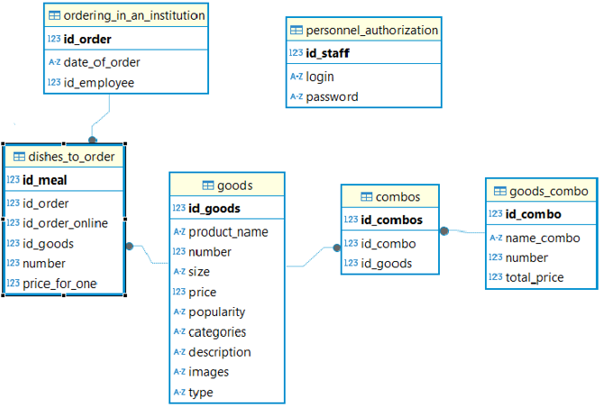
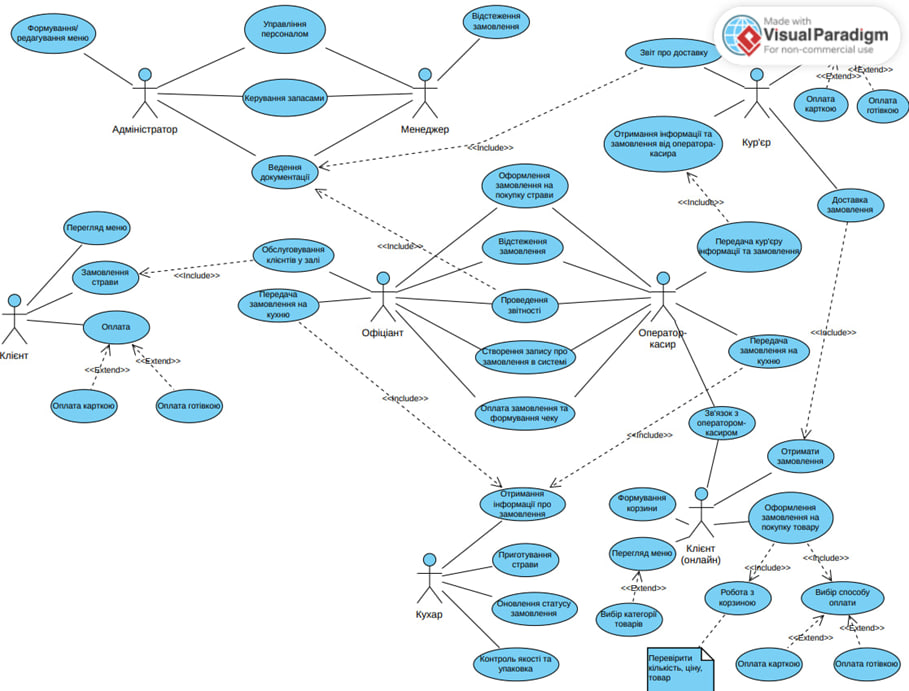
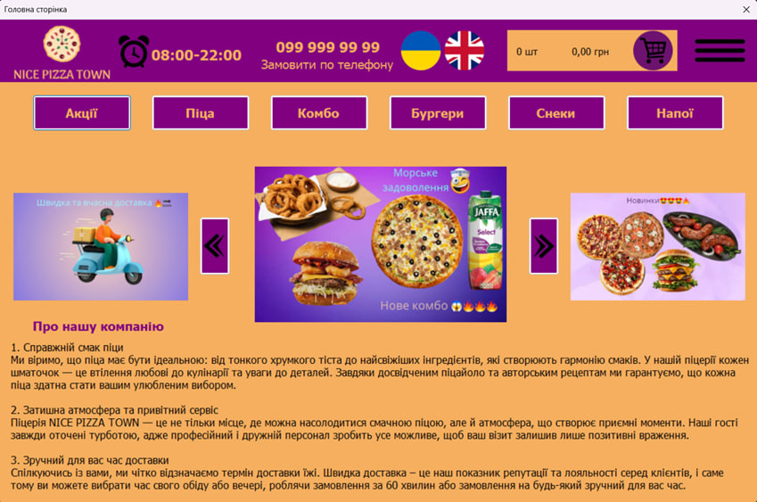
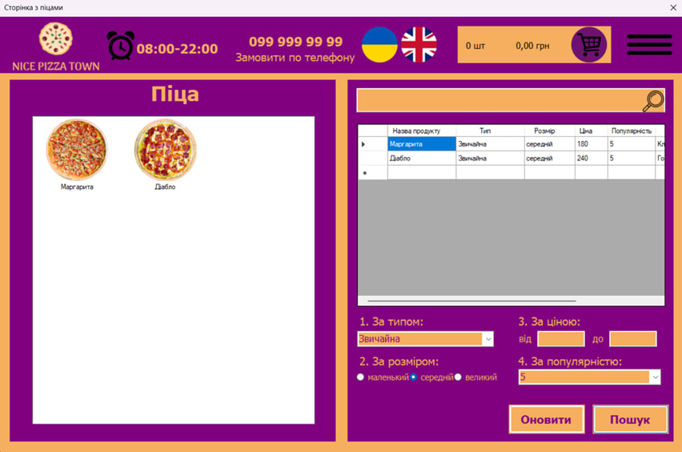
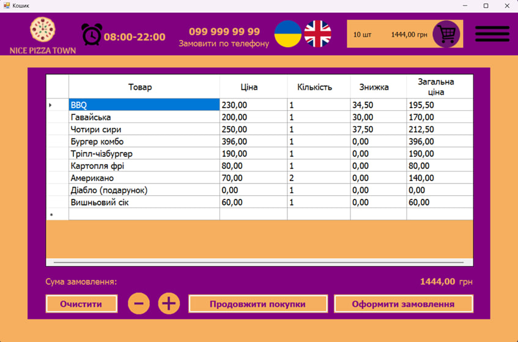
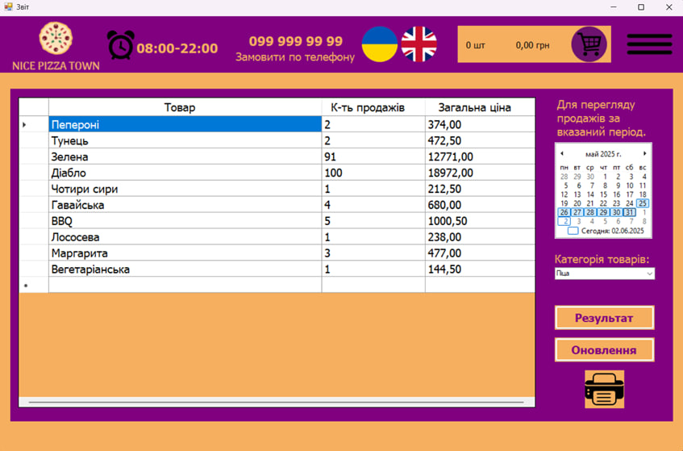

# 🍕 Pizzeria Management System

<div align="left">
  
  
  
  
  
</div>

<br>

A desktop application developed to automate restaurant management and customer service for **"Nice Pizza Town"**. The system is built with **C#**, **.NET Windows Forms**, and a local **SQLite** database. The application follows the **MVC (Model-View-Controller)** architectural pattern to provide a modular and maintainable structure.

## 🚀 Key Features

### 🍕 Menu & Customer Service

* **Menu Navigation:** Browse products by categories such as Pizzas, Combos, Burgers, Snacks, and Drinks.
* **Product Search & Filtering:** Search and filter dishes by name, type, size, price, and popularity.
* **Shopping Cart:** Add products to an order, change quantities, and automatically calculate the total order price.
* **Promotions:** Automatic application of promotional rules, including a **15% discount on pizzas** and a **free "Diablo" pizza when purchasing two coffees**, according to the specified conditions.
* **Order Processing:** Create and register customer orders and associate them with the employee responsible for processing the order.

### 👥 Staff & Authentication

* **Staff Authentication:** Login system with validation of user credentials.
* **Role-Based Access:** Different staff roles are supported according to their responsibilities, including:

  * Administrator
  * Manager
  * Cashier
  * Waiter
  * Cook
* **Order Management:** Create, edit, and view order information according to the functionality available to the staff member.

### 📊 Reporting & Management

* **Sales Reports:** Generate reports for a selected period.
* **Report Filtering:** Filter sales information by date and product category.
* **Report Printing:** Print generated sales reports.
* **Restaurant Management:** Manage information about products, orders, employees, and other restaurant data through the application.

## 🏗️ Architecture & Design

The project was developed using software engineering and system design principles.

### 🧩 Application Architecture

The application follows the **MVC (Model-View-Controller)** architectural pattern. The system is divided into separate components responsible for data, application logic, and user interface functionality.

### 🎨 UI/UX Design

Application interface prototypes and sketches were developed using **Figma**. The interface was designed to provide convenient navigation between the main application functions, including authentication, the main menu, product selection, cart management, and reporting.

### 📐 Systems Analysis

The system and its business processes were analyzed and modeled using **Visual Paradigm**. The project includes UML and Use Case models as well as BPMN-based process modeling.

### 🗄️ Database

The application uses a local **SQLite** relational database.

The database was designed and worked with using **DBeaver**. The documented database structure contains **seven main tables**:

1. `personnel_authorization`
2. `goods`
3. `goods_combo`
4. `combos`
5. `ordering_in_an_institution`
6. `dishes_to_order`
7. `employees`

The database stores information about products, combinations, orders, employees, and personnel authentication.

<details>
<summary><b>📂 Click to view Database Schema & Use Case Model</b></summary>

### Relational Database Schema



### System Use Case Diagram



</details>

## 📸 Application Showcase

### 🏠 Main Menu & Promotions



### 🍕 Menu & Product Selection



### 🛒 Cart & Order Processing



### 📊 Financial Reporting



## ⚙️ How to Run Locally

### Requirements

* **Windows**
* **Visual Studio 2022**
* **.NET Framework 4.7.2 or higher**
* Required NuGet packages used by the project
* **SQLite**

### Installation

1. Clone the repository:

```bash
git clone https://github.com/VladyslavKoval999/Pizzeria-Management-System.git
```

2. Open the solution file:

```text
Diploma_NPT.sln
```

in **Visual Studio 2022**.

3. Make sure the project targets:

```text
.NET Framework 4.7.2
```

or a compatible higher version supported by the project.

4. Restore the required NuGet packages.

5. Build the solution.

6. Run the application by pressing:

```text
F5
```

in Visual Studio.

## 🔐 Authentication

The application includes staff authentication with different roles and access to the corresponding functionality.

For security reasons, real passwords should not be published in a public repository. If test credentials are required, they should be provided separately or replaced with dedicated demo credentials.

## 📁 Project Structure

The project is organized according to the MVC architectural approach and contains components responsible for:

* **Models** — data and database-related entities.
* **Views** — Windows Forms user interface.
* **Controllers** — application logic and interaction between the interface and data.
* **Database** — SQLite data storage and related operations.

## 🛠️ Technologies Used

| Technology             | Purpose                          |
| ---------------------- | -------------------------------- |
| **C#**                 | Application development          |
| **.NET Framework**     | Application platform             |
| **Windows Forms**      | Desktop graphical user interface |
| **SQLite**             | Local relational database        |
| **MVC**                | Application architecture         |
| **Visual Studio 2022** | Development environment          |
| **DBeaver**            | Database design and management   |
| **Figma**              | UI/UX prototyping                |
| **Visual Paradigm**    | UML, Use Case and BPMN modeling  |

## 👨‍💻 Author

**Vladyslav Koval** — *Junior Software Developer*

[LinkedIn Profile](https://linkedin.com/in/vladyslav-koval2007)
